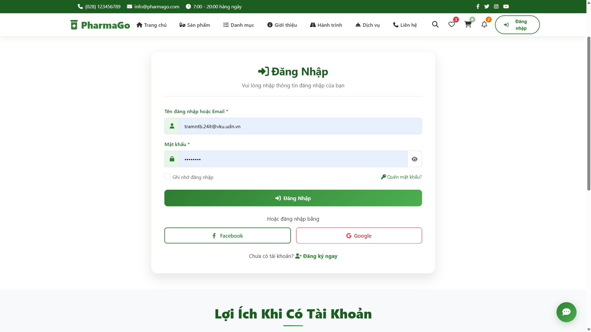
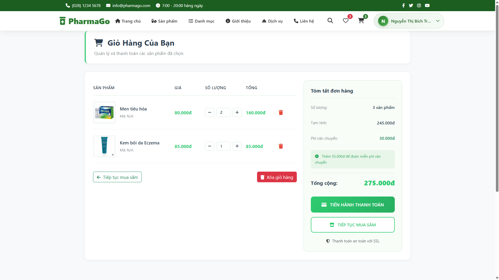
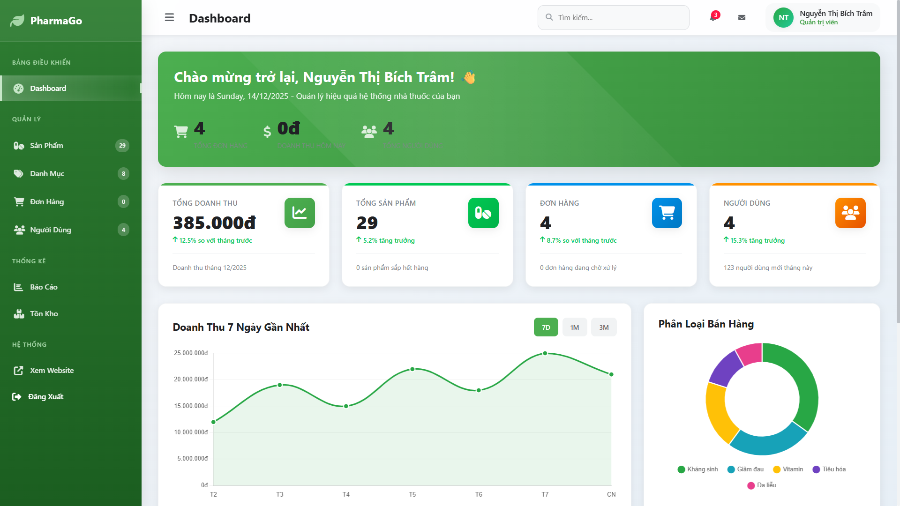
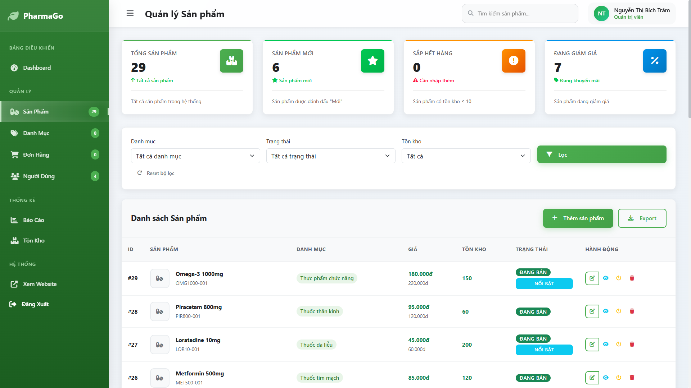
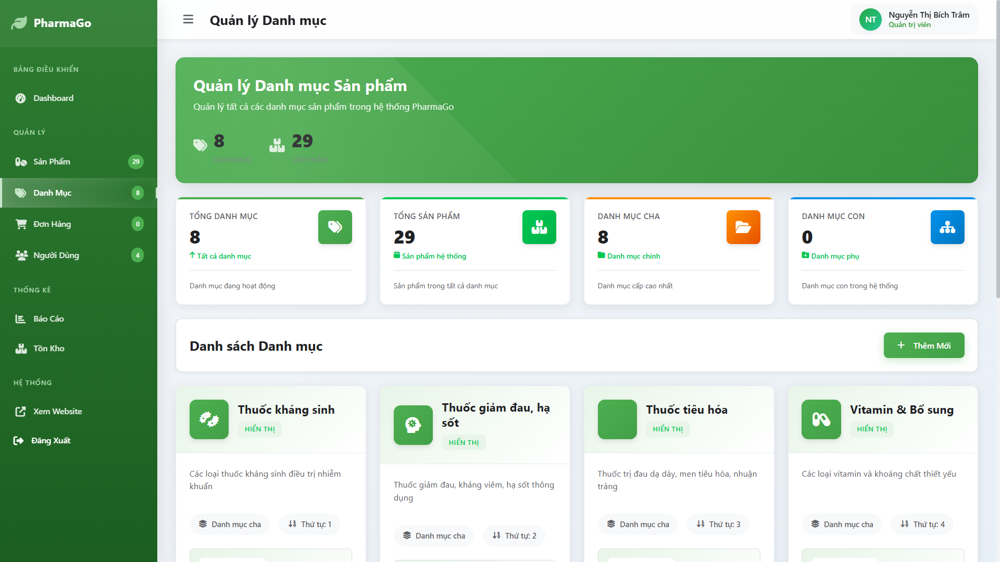
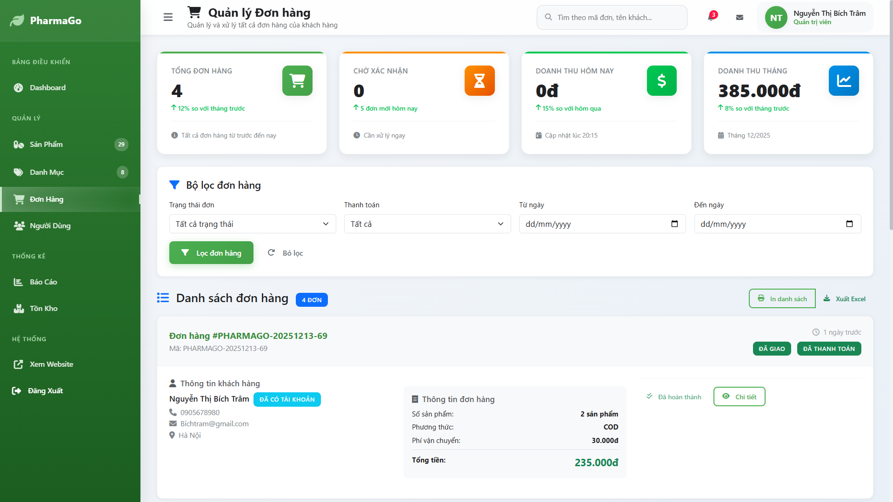
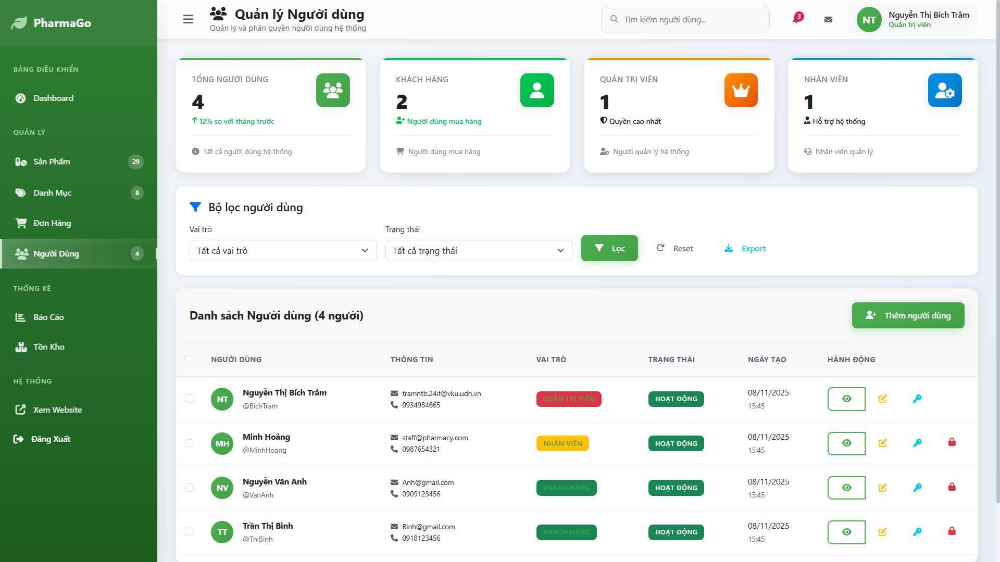
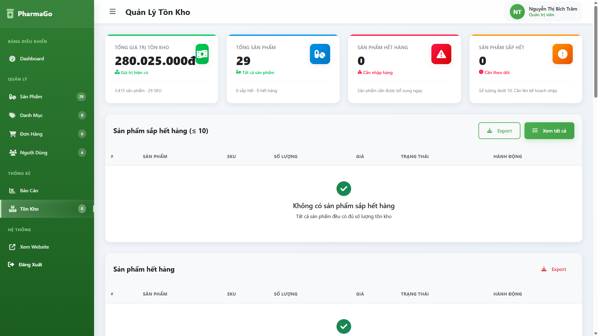
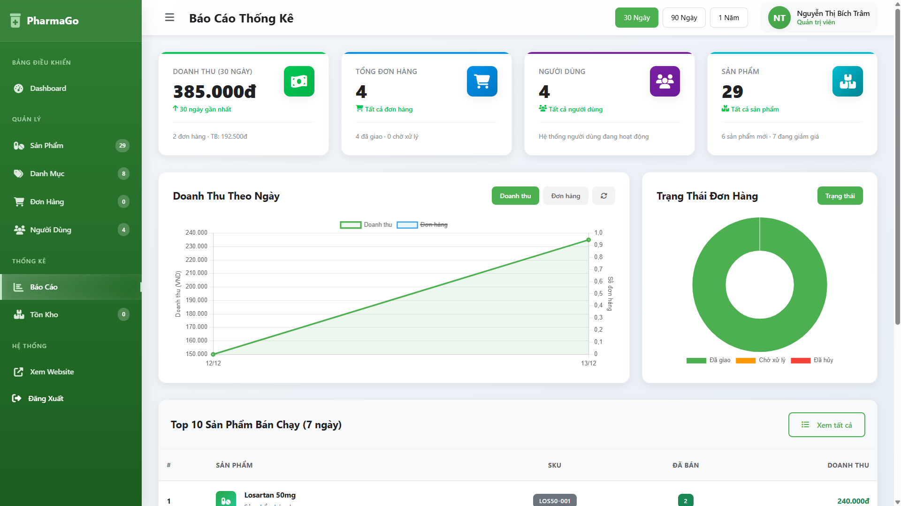

# PharmaGo Management System  
## Hệ thống Website Quản lý Nhà thuốc Kết hợp Bán hàng Online  
*(Đồ án Phát triển Ứng dụng Web)*

---

## 1. Tổng quan đề tài

Trong bối cảnh chuyển đổi số ngày càng mạnh mẽ, việc ứng dụng công nghệ thông tin vào lĩnh vực y tế và dược phẩm là nhu cầu tất yếu. Các nhà thuốc hiện nay không chỉ cần quản lý tốt hoạt động kinh doanh nội bộ mà còn phải mở rộng kênh bán hàng trực tuyến để tiếp cận khách hàng hiệu quả hơn.

**PharmaGo Management System** được xây dựng nhằm đáp ứng nhu cầu đó, là một hệ thống website hỗ trợ **quản lý nhà thuốc** đồng thời **bán thuốc online**, giúp tối ưu hóa quy trình quản lý, nâng cao hiệu quả vận hành và cải thiện trải nghiệm người dùng.

---

## 2. Mục tiêu của đồ án

### 2.1. Mục tiêu tổng quát
Xây dựng một hệ thống website quản lý nhà thuốc hoạt động ổn định, dễ sử dụng, đáp ứng đầy đủ các nghiệp vụ cơ bản trong quản lý và bán thuốc trực tuyến.

### 2.2. Mục tiêu cụ thể
- Phân tích và mô hình hóa các nghiệp vụ của một nhà thuốc
- Thiết kế và xây dựng hệ thống theo mô hình MVC
- Quản lý hiệu quả sản phẩm, danh mục, đơn hàng và khách hàng
- Hỗ trợ đặt mua thuốc trực tuyến thông qua giao diện web
- Áp dụng kiến thức đã học về phát triển ứng dụng Web vào thực tế

---

## 3. Phạm vi và đối tượng sử dụng

### 3.1. Phạm vi hệ thống
Hệ thống tập trung vào:
- Quản lý hoạt động bán lẻ thuốc
- Quản lý thông tin sản phẩm, đơn hàng, người dùng
- Bán thuốc không kê đơn thông qua website

### 3.2. Đối tượng sử dụng
- **Quản trị viên (Admin):** Quản lý toàn bộ hệ thống
- **Khách hàng:** Xem sản phẩm và đặt mua thuốc online

---

## 4. Nghiệp vụ hệ thống

### 4.1. Nghiệp vụ quản lý nhà thuốc
- Quản lý danh mục thuốc
- Quản lý thông tin thuốc (tên, giá, mô tả, hình ảnh, tồn kho)
- Theo dõi số lượng tồn kho
- Quản lý đơn hàng phát sinh
- Thống kê và báo cáo hoạt động bán hàng

### 4.2. Nghiệp vụ bán hàng online
- Khách hàng duyệt danh sách sản phẩm
- Xem chi tiết sản phẩm
- Thêm sản phẩm vào giỏ hàng
- Cập nhật số lượng sản phẩm trong giỏ
- Đặt hàng và theo dõi trạng thái đơn hàng

---

## 5. Chức năng của hệ thống

### 5.1. Chức năng dành cho khách hàng
- Đăng ký tài khoản
- Đăng nhập / Đăng xuất
- Xem danh sách sản phẩm theo danh mục
- Xem chi tiết sản phẩm
- Thêm / xóa sản phẩm khỏi giỏ hàng
- Đặt hàng
- Xem lịch sử và trạng thái đơn hàng

### 5.2. Chức năng dành cho quản trị viên
- Đăng nhập hệ thống quản trị
- Quản lý danh mục thuốc
- Quản lý sản phẩm
- Quản lý người dùng
- Quản lý đơn hàng
- Quản lý tồn kho
- Xem báo cáo và thống kê

---

## Giao diện hệ thống

### Trang đăng nhập


### Trang chủ


### Danh sách sản phẩm


### Giỏ hàng


---

## Giao diện quản trị (Admin Dashboard)

### Tổng quan hệ thống


### Quản lý sản phẩm


### Quản lý danh mục


### Quản lý đơn hàng


### Quản lý người dùng


### Quản lý tồn kho


### Báo cáo – thống kê


---

## 6. Kiến trúc và mô hình hệ thống

Hệ thống được xây dựng theo mô hình **MVC (Model – View – Controller)**:

- **Model:**  
  Xử lý dữ liệu, thao tác với cơ sở dữ liệu

- **View:**  
  Giao diện hiển thị cho người dùng và quản trị viên

- **Controller:**  
  Tiếp nhận yêu cầu, xử lý nghiệp vụ và điều hướng dữ liệu

Mô hình này giúp hệ thống:
- Dễ mở rộng
- Dễ bảo trì
- Phân tách rõ ràng giữa giao diện và xử lý nghiệp vụ

---

## 7. Công nghệ sử dụng

- **Ngôn ngữ lập trình:** PHP
- **Cơ sở dữ liệu:** MySQL
- **Frontend:** HTML, CSS, JavaScript
- **Backend:** PHP theo mô hình MVC
- **Web Server:** Apache (XAMPP)
- **Quản lý mã nguồn:** Git & GitHub

---

## 8. Quy trình triển khai hệ thống

### Bước 1: Clone source code
```bash
git clone https://github.com/Chamm286/pharmago-management-system.git
